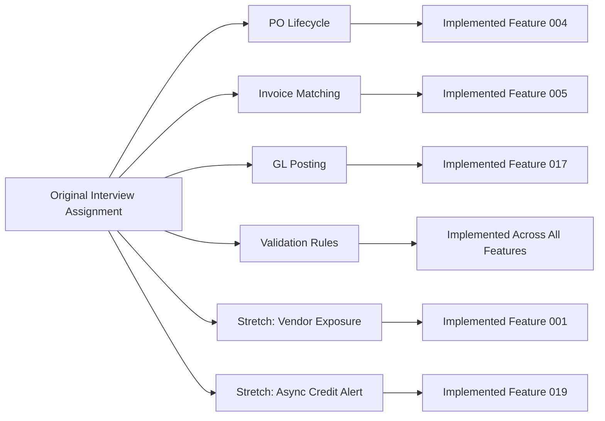
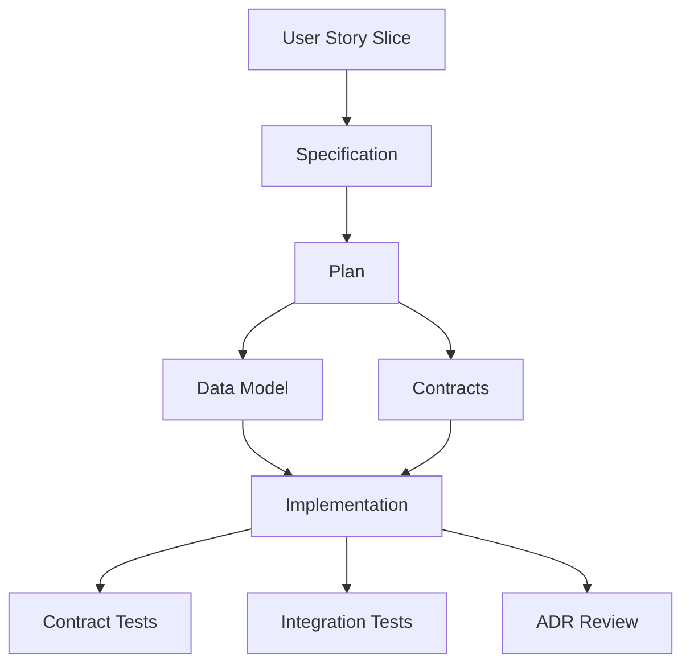
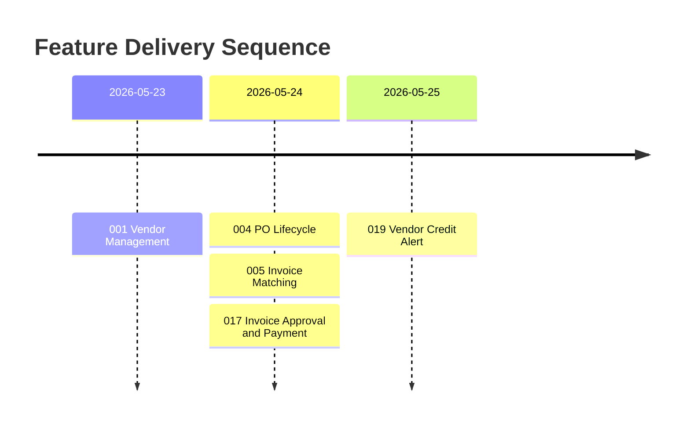
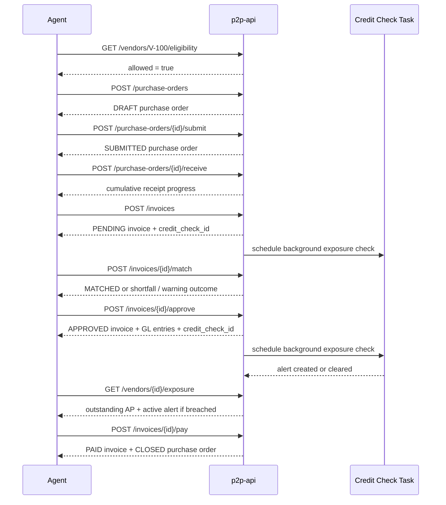
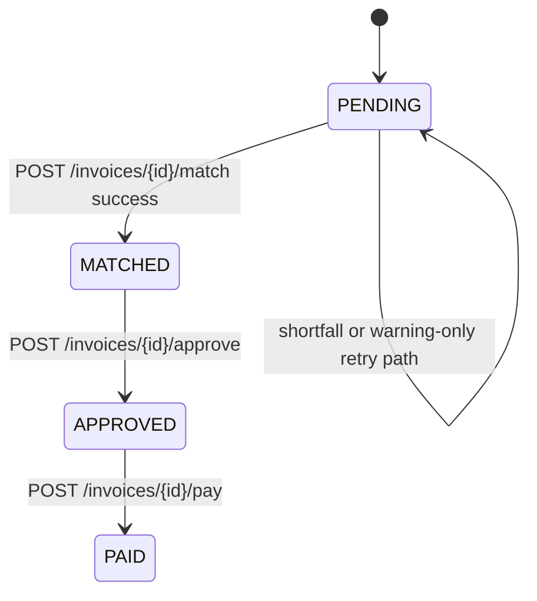
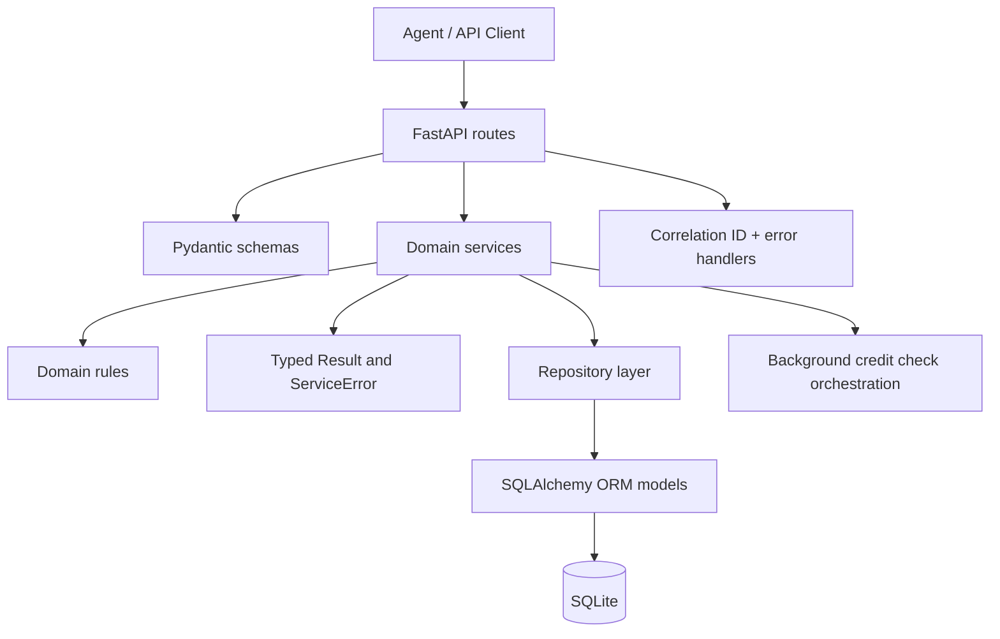
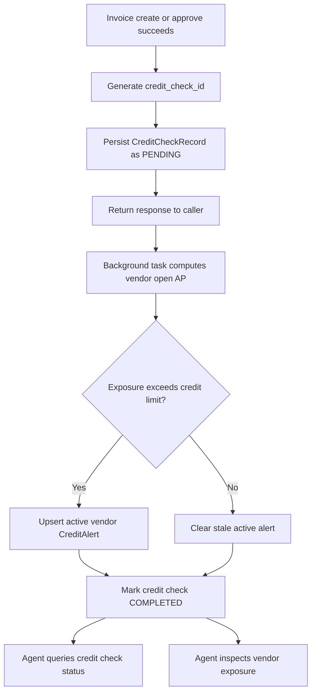

# p2p-api

Agent-first Purchase-to-Pay API built with FastAPI, SQLAlchemy, SQLite, and a Specification-Driven Development workflow.

## What This Project Is

This repository is a machine-first P2P API for a mid-size building materials distributor. It models the procurement and accounts-payable workflow that an autonomous agent would need to execute safely:

- validate vendors before creating obligations
- create, submit, receive, and inspect purchase orders
- register invoices and run 3-way match controls
- approve invoices and generate balanced GL entries
- pay approved invoices and close the linked purchase order
- monitor vendor exposure and asynchronously flag credit-limit breaches

The goal is not just to expose CRUD endpoints. The goal is to expose a workflow surface that an agent can call deterministically, recover from safely, and inspect without human interpretation.

## Why It Exists

The project started from a live-coding interview prompt captured in [original_assignment.md](original_assignment.md). The assignment asked for a clean Purchase-to-Pay API that an AI agent could use as a tool-calling interface.

The prompt intentionally emphasized:

- machine-first API design
- financially correct workflow controls
- clear agent recovery signals
- fast local execution with seeded data

Instead of treating the exercise as a one-off coding session, this repository turns the prompt into a traceable, phased implementation with specs, plans, contracts, ADRs, and tests.

## Original Assignment At A Glance

The source assignment defined four core responsibilities and three stretch directions:

- purchase-order lifecycle
- invoice registration and 3-way matching
- invoice approval with GL posting
- validation rules around vendor status, receipts, and invoice state
- stretch: vendor exposure query
- stretch: natural-language agent wrapper
- stretch: async credit-limit monitoring



## Why Specification-Driven Development

This repository uses Specification-Driven Development because the interview problem is easy to overbuild and easy to get subtly wrong.

SDD provides a hard structure for controlling that risk:

- `spec.md` captures user stories, rules, and recovery expectations in machine-usable terms
- `plan.md` turns those requirements into technical decisions and constraints
- `data-model.md` and `contracts/` make schema and API changes explicit before code lands
- ADRs document deliberate deviations from the prompt so they are reviewable
- tests validate the contract against the running service instead of against mocks

That matters here because this API handles procurement commitments, invoice controls, and accounting state. A vague workflow is acceptable in an interview conversation. It is not acceptable in code that claims financial correctness.



## How The Problem Was Broken Into Features

The repository decomposes the assignment into independently reviewable slices so each business control can be implemented and verified before the next one begins.

| Feature                        | Scope                                                      | Release  |
| ------------------------------ | ---------------------------------------------------------- | -------- |
| `001-vendor-management`        | Vendor eligibility and vendor AP exposure                  | `v0.1.0` |
| `004-po-lifecycle`             | Draft PO creation, submission, receiving, and PO query     | `v0.2.0` |
| `005-invoice-matching`         | Invoice registration and 3-way match outcomes              | `v0.3.0` |
| `017-invoice-approval-payment` | Invoice approval, GL posting, payment, and PO closure      | `v0.4.0` |
| `019-vendor-credit-alert`      | Async credit checks, durable query handle, active alerting | `v0.5.0` |



## Implemented API Surface

### Vendor endpoints

- `GET /vendors/{vendor_id}/eligibility`
- `GET /vendors/{vendor_id}/exposure`

### Purchase-order endpoints

- `POST /purchase-orders`
- `POST /purchase-orders/{purchase_order_id}/submit`
- `POST /purchase-orders/{purchase_order_id}/receive`
- `GET /purchase-orders/{purchase_order_id}`

### Invoice endpoints

- `POST /invoices`
- `POST /invoices/{invoice_id}/match`
- `POST /invoices/{invoice_id}/approve`
- `POST /invoices/{invoice_id}/pay`
- `GET /credit-checks/{credit_check_id}`

### Agent-facing API traits

- mutating operations are idempotent
- correlation IDs propagate across requests
- business failures return stable machine-readable codes
- invoice matching distinguishes hard shortfall from non-blocking partial-receipt warning
- async credit evaluation returns a durable `credit_check_id` instead of hiding work in logs

## End-to-End Workflow



## Domain Controls That Matter

The interesting part of this repository is the business behavior, not the framework wiring.

- inactive vendors cannot create new obligations
- goods receipts cannot push cumulative received quantity above ordered quantity
- invoice matching uses received value, not ordered value
- shortfalls return exact uncovered amount and next-step guidance
- partial receipt can still produce a successful match, but only with warning context
- invoices must be `MATCHED` before approval and `APPROVED` before payment
- approval creates exactly two balancing GL entries
- vendor credit checks never block create or approve actions



## Architecture

The service follows a strict layered structure so HTTP concerns, business rules, and persistence stay separated.



### Key implementation choices

- thin FastAPI route handlers
- service layer returns typed success or failure results
- repositories isolate persistence access
- real SQLite is used in tests instead of mocked persistence
- FastAPI `BackgroundTasks` is used as a bounded PoC choice for async credit checks

## Async Credit-Alert Flow

Feature `019` turns the stretch-goal idea into a queryable workflow.



This is one of the clearest examples of the repo's machine-first approach: the workflow is asynchronous, but not opaque.

## Enhancements Beyond The Prompt

Several repository choices intentionally go beyond the interview prompt because they make the API more coherent, more deterministic, and easier to defend in review.

### 1. Payment and purchase-order closure

The original assignment stopped at approval and GL posting. The repository adds `POST /invoices/{id}/pay` so the lifecycle can be completed end to end.

### 2. Durable async credit-check querying

The prompt asked for a background task that flags credit-limit breaches. The repository adds persisted `CreditCheckRecord` state and `GET /credit-checks/{id}` so an agent can query completion deterministically.

### 3. Vendor-level active alert model

Instead of duplicating invoice-level flags for the same vendor-wide breach, the repo keeps one active alert per vendor and surfaces it via vendor exposure.

### 4. Strong replay safety

Mutating endpoints use idempotency keys and fingerprint validation so retries either replay the original logical success or fail with a stable conflict error when semantics differ.

### 5. Deterministic expense-account derivation

Approval uses explicit vendor-name-based classification rules and a fallback `UNCLASSIFIED_EXPENSE` account so approval does not collapse on missing master data.

## Seed Data For Local Exploration

On startup, the app seeds a small, useful dataset when the database is empty:

- `V-100` ACME Building Supply, active, `NET30`, credit limit `2000.00`
- `V-200` Beacon Aggregates, active, `NET60`, credit limit `5000.00`
- `V-300` Dormant Timber Co, inactive, `NET30`, credit limit `1000.00`
- `PO-200` in `SUBMITTED` state with one partially received line
- `GR-200-01` receipt showing 60 of 100 units received
- seeded invoices across `PENDING`, `APPROVED`, `PAID`, and `MATCHED`

That gives you enough state to explore eligibility, receiving, matching, approval, payment, exposure, and credit-risk behaviors immediately.

## Run It Locally

### Requirements

- Python `3.14+`

### Install and start

```powershell
python -m venv .venv
.\.venv\Scripts\Activate.ps1
pip install -e .[dev]
uvicorn src.main:app --reload
```

Open:

- API docs: `http://127.0.0.1:8000/docs`
- OpenAPI JSON: `http://127.0.0.1:8000/openapi.json`

### Test commands

```powershell
pytest
pytest tests/contract/
pytest tests/integration/
pytest tests/unit/
```

## Repository Map

```text
src/
  api/             FastAPI routes, schemas, dependencies
  core/            settings, typed results, idempotency helpers, errors
  domain/          business models, rules, and services
  persistence/     SQLAlchemy models, repositories, database, seed data
tests/
  contract/        contract-level endpoint validation
  integration/     full workflow tests with real persistence
  unit/            focused rule and service tests
specs/
  001/004/005/017/019 feature specifications, plans, contracts, quickstarts
docs/adr/
  architecture decisions for schema and behavioral changes
```

## Recommended Reading Order

If you want to understand the project quickly, this order gives the cleanest path:

1. [original_assignment.md](original_assignment.md)
2. [specs/001-vendor-management/spec.md](specs/001-vendor-management/spec.md)
3. [specs/004-po-lifecycle/spec.md](specs/004-po-lifecycle/spec.md)
4. [specs/005-invoice-matching/spec.md](specs/005-invoice-matching/spec.md)
5. [specs/017-invoice-approval-payment/spec.md](specs/017-invoice-approval-payment/spec.md)
6. [specs/019-vendor-credit-alert/spec.md](specs/019-vendor-credit-alert/spec.md)
7. [CHANGELOG.md](CHANGELOG.md)

## Interview Framing

If you are using this repository in an interview or portfolio discussion, the strongest framing is:

- the assignment asked for a machine-first API, so the design optimized for autonomous callers
- the project was decomposed into feature slices to keep financial controls testable
- the repository uses SDD to preserve traceability from assignment language to running code
- enhancements were added only when they improved determinism, observability, or lifecycle completeness

That is the core story this repository tells.
